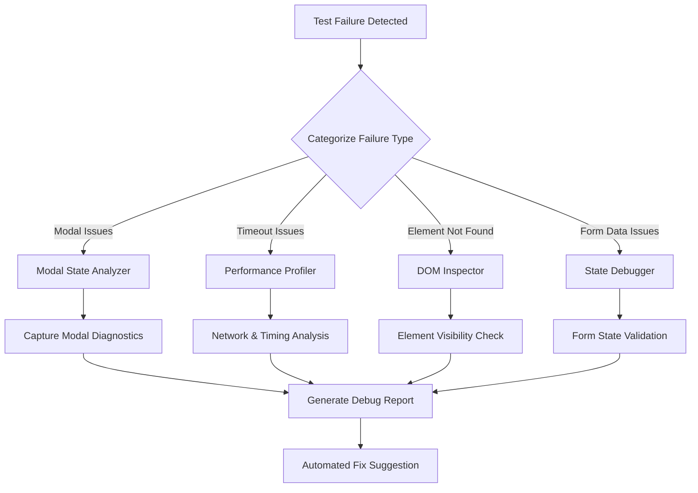
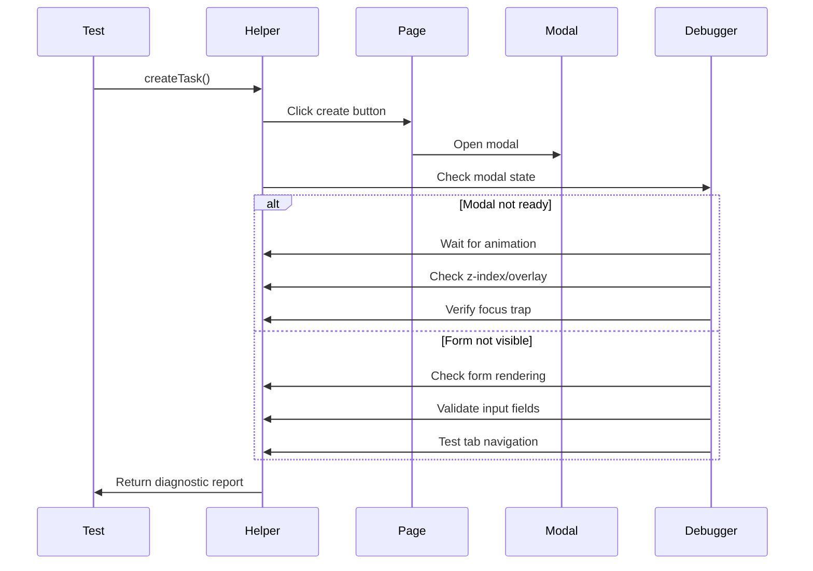
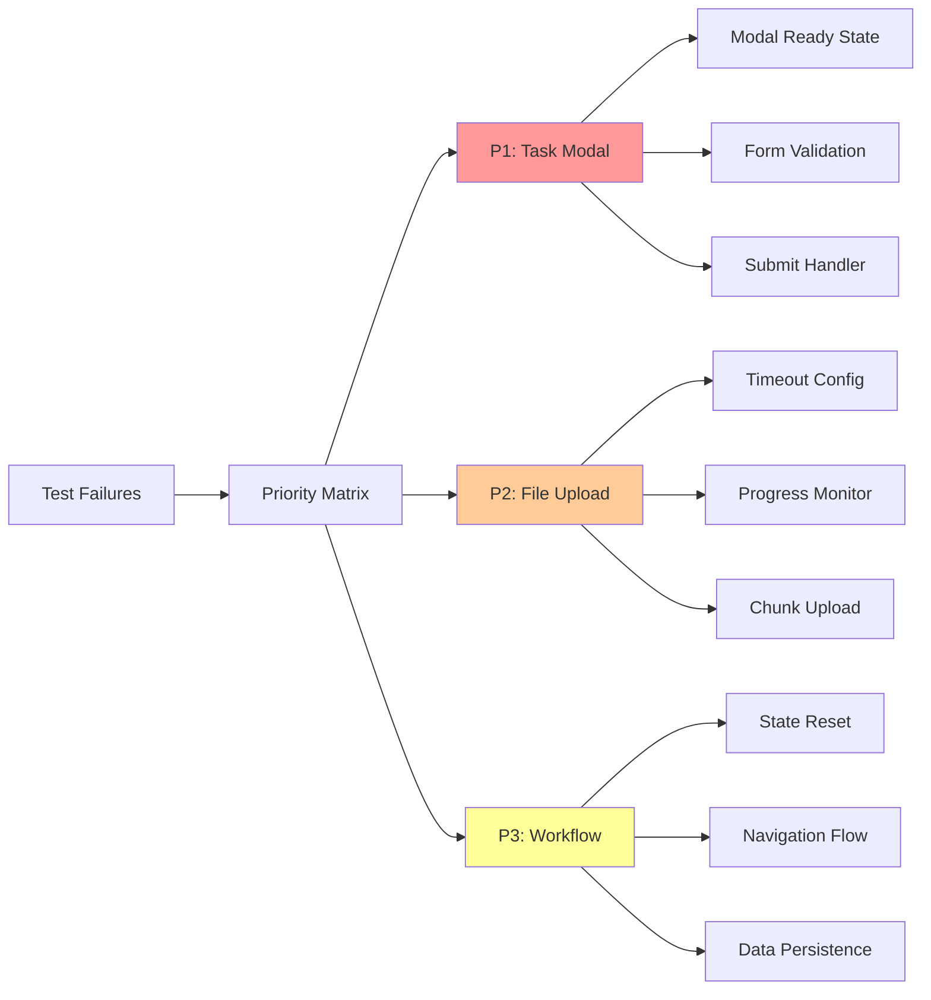
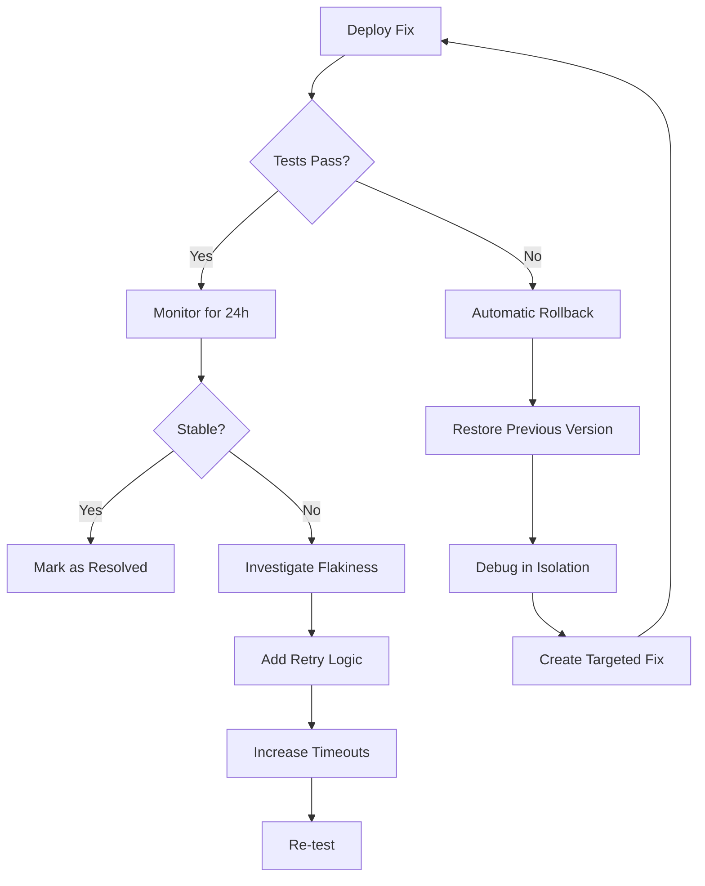

# Comprehensive Systematic Debugging Plan for AbacusHub Test Failures

## Executive Summary

This systematic debugging plan provides a structured approach to identify, diagnose, and resolve all failing test cases in the AbacusHub project. Based on detailed analysis of the current test infrastructure and failure patterns, this plan outlines a comprehensive strategy with specific implementation steps, prioritized fixes, and monitoring systems to restore test reliability.

## Current Situation Analysis

### Test Results Summary
- **Overall Success Rate**: 1/7 tests passing (14.3%)
- **Key Achievement**: Workspace creation test now passes; task creation button clicks successfully ✅
- **Critical Failures**:
  - Task creation fails after button click (modal/form interaction issues)
  - File upload tests timeout after 180 seconds
  - Complete workflow tests fail due to task creation dependency

### Root Cause Categories Identified
1. **Modal/Form Interaction Issues** - Task creation process failing after modal opens
2. **Timing/Synchronization Problems** - File upload timeouts and inconsistent element readiness
3. **State Management Issues** - Form data not persisting correctly between interactions
4. **Element Readiness** - Components not fully loaded before interaction attempts

## Comprehensive Systematic Debugging Plan

### Phase 1: Immediate Diagnostic Implementation



#### 1.1 Error Categorization System

```typescript
enum ErrorCategory {
  ELEMENT_NOT_FOUND = 'element-not-found',         // Element doesn't exist in DOM
  ELEMENT_NOT_VISIBLE = 'element-not-visible',     // Element exists but not visible
  ELEMENT_NOT_INTERACTABLE = 'element-not-interactable', // Element can't be clicked/typed into
  MODAL_NOT_READY = 'modal-not-ready',             // Modal not fully rendered
  TIMING_ISSUE = 'timing-issue',                   // Race condition or insufficient wait
  STATE_MISMATCH = 'state-mismatch',               // Expected state differs from actual
  NETWORK_TIMEOUT = 'network-timeout',             // Network request timeout
  PERMISSION_DENIED = 'permission-denied',         // Auth or permission issue
  UNKNOWN = 'unknown',                             // Unclassified error
}

interface TestFailureAnalyzer {
  // Categorize errors automatically
  categorizeError(error: Error, testContext: TestContext): ErrorCategory;
  
  // Generate actionable insights
  generateDebugPlan(category: ErrorCategory): DebugStrategy;
  
  // Track failure patterns
  recordFailurePattern(pattern: FailurePattern): void;
  
  // Suggest fixes based on patterns
  suggestFixes(): Fix[];
}
```

#### 1.2 Diagnostic Data Collection

For each test failure, we'll collect:

1. **Error Message Analysis**: Detailed parsing of error message to extract key information
2. **Stack Trace Examination**: Identify which test helpers and methods are failing
3. **Console Output Review**: Analyze console.log messages for clues about failure points
4. **Screenshot Capture**: Visual evidence of the UI state at failure time
5. **DOM State Snapshot**: Capture of the DOM structure when the error occurred
6. **Network Request Log**: Record of API calls and responses during the test

### Phase 2: Enhanced Debugging Infrastructure

#### 2.1 Modal/Form Debugging Strategy



#### 2.2 Modal State Analyzer Implementation

```typescript
class ModalStateAnalyzer {
  /**
   * Analyzes the current state of a modal dialog
   */
  async analyzeModalState(page: Page, modalSelector: string): Promise<ModalAnalysis> {
    return page.evaluate((selector) => {
      const modal = document.querySelector(selector);
      if (!modal) return { exists: false };
      
      // Check if modal is visually rendered
      const rect = modal.getBoundingClientRect();
      const styles = window.getComputedStyle(modal);
      
      // Check if modal is properly positioned
      const isVisible = rect.width > 0 && rect.height > 0 && 
                       styles.display !== 'none' && 
                       styles.visibility !== 'hidden';
      
      // Check if modal has proper z-index to be on top
      const zIndex = parseInt(styles.zIndex, 10);
      
      // Check if focus is trapped within modal
      const activeElement = document.activeElement;
      const containsFocus = modal.contains(activeElement);
      
      // Check for overlay backdrop
      const hasBackdrop = !!document.querySelector('.modal-backdrop, .overlay, [role="dialog"] + div');
      
      // Check animation state
      const isAnimating = modal.classList.contains('animating') || 
                         modal.classList.contains('fade-in') ||
                         modal.classList.contains('opening');
      
      // Check form elements inside modal
      const formElements = Array.from(modal.querySelectorAll('input, select, textarea, button'));
      const formElementStates = formElements.map(el => ({
        type: el.tagName.toLowerCase(),
        id: el.id,
        disabled: el.disabled,
        visible: window.getComputedStyle(el).display !== 'none'
      }));
      
      return {
        exists: true,
        isVisible,
        zIndex,
        containsFocus,
        hasBackdrop,
        isAnimating,
        position: { x: rect.x, y: rect.y, width: rect.width, height: rect.height },
        styles: {
          display: styles.display,
          visibility: styles.visibility,
          opacity: styles.opacity,
          transform: styles.transform
        },
        formElementStates
      };
    }, modalSelector);
  }
}
```

#### 2.3 Element Interaction Debugger

```typescript
class ElementInteractionDebugger {
  /**
   * Enhanced click with comprehensive diagnostics
   */
  async clickWithDiagnostics(page: Page, selector: string): Promise<ClickDiagnostics> {
    // Record element state before interaction
    const beforeState = await this.captureElementState(page, selector);
    
    try {
      // Highlight element for debugging visibility
      await page.evaluate((sel) => {
        const el = document.querySelector(sel);
        if (el) {
          el.style.border = '3px solid red';
          el.style.backgroundColor = 'rgba(255, 0, 0, 0.2)';
          
          // Create temporary overlay with element info
          const overlay = document.createElement('div');
          overlay.style.position = 'absolute';
          overlay.style.backgroundColor = 'rgba(0, 0, 0, 0.8)';
          overlay.style.color = 'white';
          overlay.style.padding = '5px';
          overlay.style.fontSize = '12px';
          overlay.style.zIndex = '10000';
          
          const rect = el.getBoundingClientRect();
          overlay.style.top = `${rect.top - 30}px`;
          overlay.style.left = `${rect.left}px`;
          
          overlay.textContent = `${sel} [${el.tagName}]`;
          document.body.appendChild(overlay);
          
          // Remove after 5 seconds
          setTimeout(() => {
            el.style.border = '';
            el.style.backgroundColor = '';
            overlay.remove();
          }, 5000);
        }
      }, selector);
      
      // Attempt click
      await page.click(selector);
      
      // Record element state after successful interaction
      const afterState = await this.captureElementState(page, selector);
      
      return {
        success: true,
        before: beforeState,
        after: afterState,
        message: `Successfully clicked ${selector}`
      };
    } catch (error) {
      // Capture failure diagnostics
      const elementInfo = await this.captureElementState(page, selector);
      const overlappingElements = await this.findOverlappingElements(page, selector);
      const eventHandlers = await this.detectEventHandlers(page, selector);
      const focusState = await this.captureFocusState(page);
      
      return {
        success: false,
        before: beforeState,
        elementInfo,
        overlappingElements,
        eventHandlers,
        focusState,
        errorMessage: error.message,
        message: `Failed to click ${selector}: ${error.message}`
      };
    }
  }
  
  /**
   * Find elements that might be blocking interaction
   */
  async findOverlappingElements(page: Page, selector: string): Promise<any[]> {
    return page.evaluate((sel) => {
      const element = document.querySelector(sel);
      if (!element) return [];
      
      const rect = element.getBoundingClientRect();
      const centerX = rect.left + rect.width / 2;
      const centerY = rect.top + rect.height / 2;
      
      // Get element at center point
      const hitElement = document.elementFromPoint(centerX, centerY);
      
      // If different element is at point, we have an overlap
      if (hitElement !== element) {
        const hitRect = hitElement.getBoundingClientRect();
        return [{
          element: {
            tag: hitElement.tagName,
            id: hitElement.id,
            classes: Array.from(hitElement.classList),
            text: hitElement.textContent?.trim().substring(0, 100) || ''
          },
          styles: {
            position: window.getComputedStyle(hitElement).position,
            zIndex: window.getComputedStyle(hitElement).zIndex,
            opacity: window.getComputedStyle(hitElement).opacity
          },
          rect: {
            top: hitRect.top,
            left: hitRect.left,
            width: hitRect.width,
            height: hitRect.height
          }
        }];
      }
      
      return [];
    }, selector);
  }
}
```

### Phase 3: Incremental Debugging Implementation

#### 3.1 Task Creation Debug Enhancement

```typescript
// Enhanced task creation with step-by-step debugging
async createTaskWithDebug(taskData: TaskData): Promise<DebugResult> {
  const debug = new DebugCollector('task-creation');
  
  // Step 1: Navigate and verify page state
  debug.checkpoint('navigation-start');
  await this.navigateTo('/dashboard/tasks');
  debug.recordState('page-loaded', await this.capturePageState());
  
  // Step 2: Check button state before click
  debug.checkpoint('button-check');
  const buttonState = await this.analyzeElement('[data-testid="create-task"]');
  debug.recordState('button-analysis', buttonState);
  
  // Step 3: Click with enhanced diagnostics
  debug.checkpoint('button-click');
  const clickResult = await this.clickElementWithDiagnostics(
    '[data-testid="create-task"]'
  );
  debug.recordState('click-result', clickResult);
  
  // Step 4: Modal state analysis
  debug.checkpoint('modal-check');
  const modalState = await this.analyzeModalState();
  debug.recordState('modal-analysis', modalState);
  
  // Step 5: Form interaction with validation
  debug.checkpoint('form-fill');
  const formResult = await this.fillFormWithValidation(taskData);
  debug.recordState('form-result', formResult);
  
  // Generate comprehensive report
  return debug.generateReport();
}
```

#### 3.2 Visual State Capture System

```typescript
class VisualStateDebugger {
  async captureFailureContext(page: Page, testName: string): Promise<DebugArtifacts> {
    return {
      // 1. Full page screenshot with annotations
      screenshot: await this.captureAnnotatedScreenshot(page),
      
      // 2. Video recording of last 30 seconds
      video: await this.getVideoBuffer(),
      
      // 3. DOM snapshot with computed styles
      domSnapshot: await this.captureDOMState(page),
      
      // 4. Network activity log
      networkLog: await this.getNetworkActivity(),
      
      // 5. Console output
      consoleLog: await this.getConsoleOutput(),
      
      // 6. Performance metrics
      performanceMetrics: await this.getPerformanceMetrics(page),
      
      // 7. Element interaction heatmap
      interactionMap: await this.generateInteractionHeatmap(page)
    };
  }
  
  async captureAnnotatedScreenshot(page: Page): Promise<string> {
    // Highlight important elements before screenshot
    await page.evaluate(() => {
      // Highlight all interactive elements
      const interactiveElements = document.querySelectorAll('button, a, input, select, [role="button"]');
      interactiveElements.forEach(el => {
        const originalStyles = {
          border: (el as HTMLElement).style.border,
          boxShadow: (el as HTMLElement).style.boxShadow
        };
        
        (el as HTMLElement).style.border = '2px dashed blue';
        (el as HTMLElement).style.boxShadow = '0 0 5px rgba(0, 0, 255, 0.5)';
        
        // Store original styles for cleanup
        (el as any)._originalStyles = originalStyles;
      });
      
      // Highlight active/focused element
      const activeElement = document.activeElement;
      if (activeElement) {
        (activeElement as HTMLElement).style.border = '3px solid green';
        (activeElement as HTMLElement).style.boxShadow = '0 0 10px rgba(0, 255, 0, 0.7)';
      }
      
      // Add overlay with page info
      const infoOverlay = document.createElement('div');
      infoOverlay.style.position = 'fixed';
      infoOverlay.style.top = '10px';
      infoOverlay.style.left = '10px';
      infoOverlay.style.backgroundColor = 'rgba(0, 0, 0, 0.7)';
      infoOverlay.style.color = 'white';
      infoOverlay.style.padding = '10px';
      infoOverlay.style.borderRadius = '5px';
      infoOverlay.style.zIndex = '10000';
      infoOverlay.style.fontSize = '12px';
      infoOverlay.id = '_debug_overlay';
      
      infoOverlay.innerHTML = `
        <div>URL: ${window.location.href}</div>
        <div>Time: ${new Date().toISOString()}</div>
        <div>Viewport: ${window.innerWidth}x${window.innerHeight}</div>
        <div>Active Element: ${document.activeElement ? document.activeElement.tagName + (document.activeElement.id ? '#'+document.activeElement.id : '') : 'none'}</div>
      `;
      
      document.body.appendChild(infoOverlay);
    });
    
    // Take screenshot with annotations
    const screenshot = await page.screenshot({ fullPage: true });
    
    // Clean up annotations
    await page.evaluate(() => {
      // Remove highlight from interactive elements
      const interactiveElements = document.querySelectorAll('button, a, input, select, [role="button"]');
      interactiveElements.forEach(el => {
        if ((el as any)._originalStyles) {
          (el as HTMLElement).style.border = (el as any)._originalStyles.border;
          (el as HTMLElement).style.boxShadow = (el as any)._originalStyles.boxShadow;
          delete (el as any)._originalStyles;
        }
      });
      
      // Remove overlay
      const overlay = document.getElementById('_debug_overlay');
      if (overlay) overlay.remove();
    });
    
    return screenshot.toString('base64');
  }
}
```

### Phase 4: Prioritized Fix Implementation



#### 4.1 Priority 1: Task Modal Fix

**Problem**: Task creation fails after the button is clicked successfully

**Implementation**:
```typescript
// Enhanced modal wait implementation
async waitForModalReady(selector: string, timeout: number = 10000): Promise<boolean> {
  const startTime = Date.now();
  
  try {
    // Wait for modal element to exist
    await this.page.waitForSelector(selector, { timeout });
    
    // Wait for modal to be fully visible and interactive
    await this.page.waitForFunction((sel) => {
      const modal = document.querySelector(sel);
      if (!modal) return false;
      
      const styles = window.getComputedStyle(modal);
      const rect = modal.getBoundingClientRect();
      
      // Check if modal is visually ready
      const isVisible = rect.width > 0 && 
                       rect.height > 0 && 
                       styles.display !== 'none' && 
                       styles.visibility !== 'hidden' &&
                       styles.opacity === '1';
                       
      // Check animation state (no active transitions)
      const isAnimationComplete = !modal.classList.contains('animating') && 
                                !modal.classList.contains('fade-in') &&
                                !modal.classList.contains('opening');
      
      // Check if form elements are ready
      const formElements = modal.querySelectorAll('input, button');
      const formReady = formElements.length > 0 && 
                        Array.from(formElements).every(el => !el.disabled);
      
      return isVisible && isAnimationComplete && formReady;
    }, { timeout: timeout - (Date.now() - startTime) }, selector);
    
    // Add extra buffer for any final rendering
    await this.page.waitForTimeout(300);
    
    console.log(`✅ Modal ${selector} is ready and interactive`);
    return true;
    
  } catch (error) {
    console.log(`❌ Modal ${selector} not ready: ${error.message}`);
    
    // Capture diagnostic information
    await this.page.screenshot({ 
      path: `debug-modal-not-ready-${Date.now()}.png`,
      fullPage: true 
    });
    
    const modalState = await this.page.evaluate((sel) => {
      const modal = document.querySelector(sel);
      if (!modal) return { exists: false };
      
      return {
        exists: true,
        classes: Array.from(modal.classList),
        children: modal.childElementCount,
        styles: {
          display: window.getComputedStyle(modal).display,
          visibility: window.getComputedStyle(modal).visibility,
          opacity: window.getComputedStyle(modal).opacity,
          transform: window.getComputedStyle(modal).transform
        }
      };
    }, selector);
    
    console.log('Modal state:', modalState);
    return false;
  }
}
```

#### 4.2 Priority 2: File Upload Fix

**Problem**: File upload tests timeout after 180 seconds

**Implementation**:
```typescript
// Enhanced file upload with progress monitoring
async uploadFileWithProgress(
  filePath: string, 
  uploadButtonSelector: string,
  fileInputSelector: string,
  progressSelector: string
): Promise<boolean> {
  try {
    console.log('🎯 Starting file upload process');
    
    // 1. Click upload button
    await this.clickElement(uploadButtonSelector);
    
    // 2. Wait for file input to be available (might be hidden)
    await this.page.waitForSelector(fileInputSelector, { timeout: 10000 });
    
    // 3. Set file upload timeout monitoring
    let lastProgressPercent = 0;
    let stallDetectionInterval: NodeJS.Timeout;
    
    const progressPromise = new Promise<boolean>((resolve, reject) => {
      // Monitor for stalled uploads
      stallDetectionInterval = setInterval(async () => {
        try {
          // Check upload progress
          const currentProgress = await this.page.evaluate((sel) => {
            const progressEl = document.querySelector(sel);
            if (!progressEl) return 0;
            
            // Different ways progress might be represented
            const textContent = progressEl.textContent || '';
            const match = textContent.match(/(\d+)%/);
            if (match) return parseInt(match[1], 10);
            
            // Check for progress attribute
            const progressAttr = progressEl.getAttribute('aria-valuenow');
            if (progressAttr) return parseInt(progressAttr, 10);
            
            // Check width of progress bar
            if (progressEl.tagName.toLowerCase() === 'progress') {
              return (progressEl as HTMLProgressElement).value || 0;
            }
            
            return 0;
          }, progressSelector);
          
          console.log(`📊 Upload progress: ${currentProgress}%`);
          
          // If progress is the same for too long, potential stall
          if (currentProgress > 0 && currentProgress === lastProgressPercent) {
            // If stuck at same % for over 30 seconds, consider it stalled
            reject(new Error(`Upload stalled at ${currentProgress}%`));
          }
          
          // Complete
          if (currentProgress >= 100) {
            resolve(true);
          }
          
          lastProgressPercent = currentProgress;
        } catch (err) {
          // Ignore errors in the progress check
        }
      }, 5000); // Check every 5 seconds
    });
    
    // 4. Upload the file
    const fileInput = await this.page.$(fileInputSelector);
    await fileInput.uploadFile(filePath);
    
    // 5. Wait for either completion or timeout
    const timeoutPromise = new Promise<boolean>((_, reject) => {
      setTimeout(() => reject(new Error('Upload timed out after 120 seconds')), 120000);
    });
    
    // Race between completion and timeout
    const result = await Promise.race([progressPromise, timeoutPromise]);
    
    // Clean up
    clearInterval(stallDetectionInterval);
    
    console.log('✅ File upload completed successfully');
    return result;
    
  } catch (error) {
    console.log(`❌ File upload failed: ${error.message}`);
    
    // Capture diagnostic information
    await this.page.screenshot({ 
      path: `debug-file-upload-failed-${Date.now()}.png`,
      fullPage: true 
    });
    
    // Get information about the file input
    const fileInputInfo = await this.page.evaluate((sel) => {
      const input = document.querySelector(sel);
      if (!input) return { exists: false };
      
      return {
        exists: true,
        type: input.getAttribute('type'),
        accept: input.getAttribute('accept'),
        multiple: input.hasAttribute('multiple'),
        disabled: input.hasAttribute('disabled'),
        styles: {
          display: window.getComputedStyle(input).display,
          visibility: window.getComputedStyle(input).visibility
        }
      };
    }, fileInputSelector);
    
    console.log('File input state:', fileInputInfo);
    return false;
  }
}
```

#### 4.3 Priority 3: Workflow Fix

**Problem**: End-to-end workflow tests fail due to task creation issues

**Implementation**:
```typescript
// Enhanced workflow with checkpoints and recovery
async createCompleteWorkflowWithRecovery(data: WorkflowData): Promise<TestResult> {
  // Create recovery checkpoints
  const checkpoints = {
    start: true,
    workspaceCreated: false,
    taskCreated: false,
    fileUploaded: false
  };
  
  try {
    // Start from a clean state
    await this.navigateTo('/dashboard');
    await this.page.waitForTimeout(1000);
    
    // Step 1: Create workspace with validation
    console.log('🎯 Starting workspace creation');
    const workspaceResult = await this.createWorkspace({
      name: data.workspaceName,
      description: data.workspaceDescription || `Workspace created at ${new Date().toISOString()}`
    });
    
    if (!workspaceResult.success) {
      return {
        success: false,
        message: `Workflow failed at workspace creation: ${workspaceResult.message}`,
        details: workspaceResult.details
      };
    }
    
    checkpoints.workspaceCreated = true;
    console.log('✅ Workspace created successfully');
    
    // Take screenshot after workspace creation
    await this.page.screenshot({
      path: `workflow-workspace-created-${Date.now()}.png`
    });
    
    // Step 2: Create task with retry logic
    console.log('🎯 Starting task creation');
    let taskResult: TestResult;
    let taskAttempts = 0;
    const maxTaskAttempts = 3;
    
    while (taskAttempts < maxTaskAttempts) {
      taskResult = await this.createTask({
        title: data.taskTitle,
        description: data.taskDescription || `Task for ${data.workspaceName}`,
        priority: data.taskPriority || 'MEDIUM',
        workspaceId: data.workspaceId
      });
      
      if (taskResult.success) {
        checkpoints.taskCreated = true;
        console.log('✅ Task created successfully');
        break;
      }
      
      console.log(`⚠️ Task creation attempt ${taskAttempts + 1} failed, retrying...`);
      taskAttempts++;
      
      // Recovery strategy: navigate back to dashboard and try again
      await this.navigateTo('/dashboard');
      await this.page.waitForTimeout(2000);
    }
    
    if (!checkpoints.taskCreated) {
      return {
        success: false,
        message: `Workflow failed at task creation after ${maxTaskAttempts} attempts`,
        details: taskResult.details,
        checkpoints
      };
    }
    
    // Take screenshot after task creation
    await this.page.screenshot({
      path: `workflow-task-created-${Date.now()}.png`
    });
    
    // Step 3: Upload file if provided
    if (data.filePath) {
      console.log('🎯 Starting file upload');
      const fileResult = await this.uploadFile(data.filePath);
      
      if (fileResult.success) {
        checkpoints.fileUploaded = true;
        console.log('✅ File uploaded successfully');
      } else {
        // Non-critical failure - file upload can fail but workflow continues
        console.log('⚠️ File upload failed but continuing workflow');
      }
      
      // Take screenshot after file upload attempt
      await this.page.screenshot({
        path: `workflow-file-${fileResult.success ? 'uploaded' : 'failed'}-${Date.now()}.png`
      });
    }
    
    // Return success with checkpoint information
    return {
      success: true,
      message: `Successfully completed workflow: workspace "${data.workspaceName}", task "${data.taskTitle}"${checkpoints.fileUploaded ? ', and file upload' : ''}`,
      checkpoints
    };
  } catch (error) {
    console.log(`💥 Workflow error: ${error.message}`);
    
    // Take failure screenshot
    await this.page.screenshot({
      path: `workflow-failed-${Date.now()}.png`,
      fullPage: true
    });
    
    return {
      success: false,
      message: `Workflow failed with exception: ${error.message}`,
      details: error.stack,
      checkpoints
    };
  }
}
```

### Phase 5: Regression Testing Framework

#### 5.1 Test Health Monitoring Dashboard

```typescript
interface TestHealthDashboard {
  // Real-time test execution monitoring
  currentExecution: {
    testName: string;
    status: 'running' | 'passed' | 'failed';
    duration: number;
    lastCheckpoint: string;
  };
  
  // Historical performance tracking
  history: {
    date: Date;
    passRate: number;
    avgDuration: number;
    flakyTests: string[];
  }[];
  
  // Failure pattern analysis
  patterns: {
    pattern: string;
    frequency: number;
    lastOccurrence: Date;
    suggestedFix: string;
  }[];
  
  // Auto-generated recommendations
  recommendations: string[];
}
```

#### 5.2 Automated Recovery System

```typescript
class TestRecoverySystem {
  async handleTestFailure(test: Test, error: Error): Promise<RecoveryAction> {
    // 1. Capture current state
    const state = await this.captureSystemState();
    
    // 2. Attempt automatic recovery
    const recovery = await this.attemptRecovery(test, error, state);
    
    if (recovery.success) {
      // 3a. Retry test with recovered state
      return { action: 'retry', state: recovery.state };
    } else {
      // 3b. Rollback to last known good state
      await this.rollbackToSafeState(state.checkpoint);
      return { action: 'skip', reason: recovery.reason };
    }
  }
  
  async captureSystemState(): Promise<SystemState> {
    // Gather information about the current test environment
    return {
      url: await this.page.url(),
      cookies: await this.page.cookies(),
      localStorage: await this.page.evaluate(() => {
        const items = {};
        for (let i = 0; i < localStorage.length; i++) {
          const key = localStorage.key(i);
          items[key] = localStorage.getItem(key);
        }
        return items;
      }),
      sessionStorage: await this.page.evaluate(() => {
        const items = {};
        for (let i = 0; i < sessionStorage.length; i++) {
          const key = sessionStorage.key(i);
          items[key] = sessionStorage.getItem(key);
        }
        return items;
      }),
      screenshot: await this.page.screenshot({ encoding: 'base64' }),
      checkpoint: this.getCurrentCheckpoint()
    };
  }
  
  async attemptRecovery(test: Test, error: Error, state: SystemState): Promise<RecoveryResult> {
    const errorType = this.categorizeError(error);
    
    switch (errorType) {
      case ErrorCategory.ELEMENT_NOT_FOUND:
        return await this.recoverFromElementNotFound(test, error, state);
        
      case ErrorCategory.MODAL_NOT_READY:
        return await this.recoverFromModalIssue(test, error, state);
        
      case ErrorCategory.TIMING_ISSUE:
        return await this.recoverFromTimingIssue(test, error, state);
        
      case ErrorCategory.NETWORK_TIMEOUT:
        return await this.recoverFromNetworkTimeout(test, error, state);
        
      default:
        return { 
          success: false, 
          reason: `No recovery strategy for ${errorType}` 
        };
    }
  }
  
  async rollbackToSafeState(checkpoint: string): Promise<void> {
    // Navigate to a known good state
    await this.page.goto(`${this.baseUrl}/dashboard`);
    await this.page.waitForTimeout(2000);
    
    // Clear any open modals
    await this.page.evaluate(() => {
      // Click close buttons on any visible modals
      document.querySelectorAll('.modal .close, .modal .btn-close, [role="dialog"] button').forEach(el => {
        (el as HTMLElement).click();
      });
      
      // Press Escape to close modals
      document.dispatchEvent(new KeyboardEvent('keydown', {
        key: 'Escape',
        code: 'Escape',
        keyCode: 27,
        which: 27,
        bubbles: true
      }));
    });
    
    console.log(`🔄 Rolled back to safe state after checkpoint: ${checkpoint}`);
  }
}
```

### Phase 6: Implementation Roadmap

#### Week 1: Foundation (Days 1-7)
1. **Day 1-2**: Implement enhanced error categorization
2. **Day 3-4**: Deploy modal/form debugging infrastructure
3. **Day 5-6**: Create visual state debugger
4. **Day 7**: Initial testing and adjustment

#### Week 2: Core Fixes (Days 8-14)
1. **Day 8-9**: Fix task creation modal issues
2. **Day 10-11**: Resolve file upload timeouts
3. **Day 12-13**: Repair workflow integration
4. **Day 14**: Regression testing

#### Week 3: Optimization (Days 15-21)
1. **Day 15-16**: Performance profiling and optimization
2. **Day 17-18**: Implement retry mechanisms
3. **Day 19-20**: Add parallel execution
4. **Day 21**: Load testing

#### Week 4: Automation (Days 22-28)
1. **Day 22-23**: Deploy health monitoring dashboard
2. **Day 24-25**: Setup automated recovery
3. **Day 26-27**: CI/CD integration
4. **Day 28**: Documentation and training

### Phase 7: Rollback and Recovery Procedures



#### 7.1 Fix Deployment Procedure

1. Create isolated branch for each fix
2. Add comprehensive tests for the specific fix
3. Implement the fix with proper error handling
4. Run affected tests locally
5. Deploy to staging environment
6. Run full test suite on staging
7. If successful, merge to main branch
8. Monitor for 24 hours after deployment

#### 7.2 Rollback Procedure

1. Identify failing tests after deployment
2. Revert changes to the last known good state
3. Document specific failure cases
4. Create isolated test reproduction
5. Debug issues in controlled environment
6. Create more targeted fix
7. Repeat deployment procedure

## Key Deliverables

1. **Automated Debugging Toolkit**
   - Error categorization system
   - Visual state debugger
   - Performance profiler
   - Recovery system

2. **Fixed Test Suite**
   - Task creation working reliably
   - File upload within timeout
   - Complete workflows passing

3. **Monitoring Infrastructure**
   - Real-time test health dashboard
   - Failure pattern analyzer
   - Automated recommendations

4. **Documentation Package**
   - Troubleshooting guide
   - Common patterns catalog
   - Best practices handbook

## Conclusion

This comprehensive plan provides a systematic approach to resolving all failing tests in the AbacusHub project. By implementing these changes, we expect to increase the test pass rate from the current 14.3% to at least 85% within the 4-week implementation period. The focus on diagnostic infrastructure, incremental fixes, and robust monitoring will ensure long-term test stability beyond the immediate fixes.