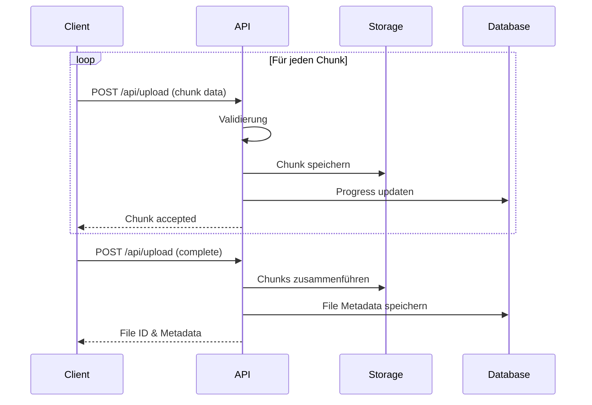
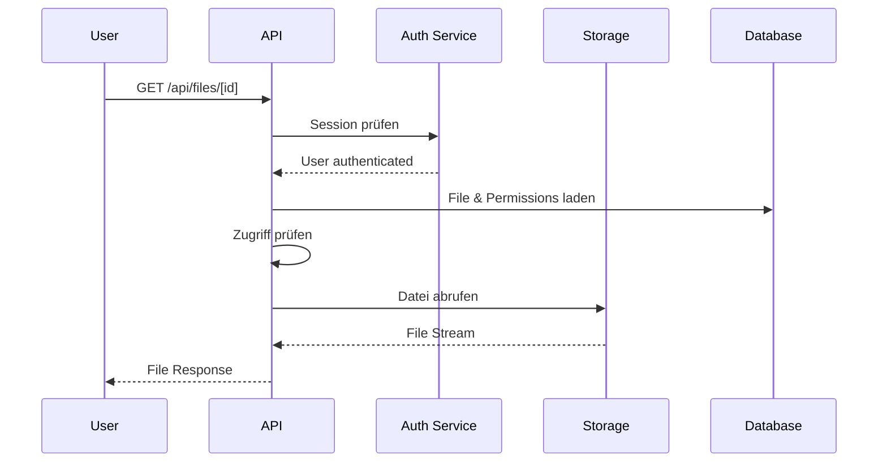

# File Upload Architecture - AbacusHub

## Übersicht

Diese Dokumentation beschreibt die Architektur des File-Upload-Systems mit API-basierter Auslieferung und S3-kompatibler Storage-Vorbereitung.

## Architektur-Entscheidungen

### ADR-001: API-basierte File Serving
- **Status**: Akzeptiert
- **Kontext**: Dateien müssen sicher mit Berechtigungsprüfung ausgeliefert werden
- **Entscheidung**: Alle Datei-Downloads laufen über API Routes mit Authentifizierung
- **Konsequenzen**: Höhere Serverlast, aber vollständige Zugriffskontrolle

### ADR-002: S3-kompatible Storage Abstraction
- **Status**: Geplant
- **Kontext**: System muss für verschiedene Storage-Backends vorbereitet sein
- **Entscheidung**: Storage Interface abstrahieren für lokales FS und S3
- **Konsequenzen**: Einfache Migration zu Cloud Storage möglich

## System-Komponenten

```mermaid
graph TB
    subgraph "Client Layer"
        A[React Upload Component]
        B[Upload Hook]
        C[Resumable Upload Logic]
    end
    
    subgraph "API Layer"
        D[/api/upload]
        E[/api/files/[id]]
        F[/api/files/serve/[...path]]
    end
    
    subgraph "Storage Layer"
        G[Storage Interface]
        H[Local FS Adapter]
        I[S3 Adapter]
        J[MinIO Adapter]
    end
    
    subgraph "Data Layer"
        K[Prisma ORM]
        L[File Metadata]
        M[Upload Progress]
    end
    
    A --> B
    B --> C
    C --> D
    D --> G
    E --> G
    F --> G
    G --> H
    G --> I
    G --> J
    D --> K
    E --> K
    K --> L
    K --> M
```

## Upload Flow

### 1. Chunk Upload Prozess


### 2. File Serving Prozess


## Storage Interface

```typescript
interface StorageProvider {
  // Upload operations
  saveChunk(fileId: string, chunkIndex: number, data: Buffer): Promise<void>;
  assembleChunks(fileId: string, totalChunks: number): Promise<string>;
  
  // File operations
  getFile(path: string): Promise<Buffer>;
  getFileStream(path: string): Promise<ReadableStream>;
  deleteFile(path: string): Promise<void>;
  
  // Utility operations
  getFileUrl(path: string, expiry?: number): Promise<string>;
  fileExists(path: string): Promise<boolean>;
  getFileSize(path: string): Promise<number>;
}
```

## Sicherheitskonzepte

### 1. Upload Sicherheit
- **Dateityp-Validierung**: Whitelist erlaubter MIME-Types
- **Größenbeschränkung**: Max 500MB pro Datei
- **Rate Limiting**: Max 10 parallele Uploads pro User
- **Chunk Validierung**: Prüfsummen für Datenintegrität

### 2. Download Sicherheit
- **Authentifizierung**: Jeder Request benötigt gültige Session
- **Autorisierung**: Workspace-basierte Berechtigungen
- **Path Traversal Schutz**: Validierung aller Dateipfade
- **Zeitbasierte URLs**: Für S3 signed URLs (geplant)

## Performance-Optimierungen

### 1. Upload Performance
- **Adaptive Chunk-Größe**: 1-5MB basierend auf Netzwerkgeschwindigkeit
- **Parallele Chunks**: Bis zu 3 gleichzeitige Chunk-Uploads
- **Compression**: Gzip für Text-Dateien
- **Resume Logic**: Automatische Wiederaufnahme bei Unterbrechung

### 2. Download Performance
- **Streaming**: Große Dateien werden gestreamt, nicht komplett geladen
- **Range Requests**: Unterstützung für partial content
- **Caching Headers**: Optimale Browser-Cache-Nutzung
- **CDN-Ready**: Vorbereitet für CDN-Integration

## Fehlerbehandlung

### Client-Side Error Recovery
```typescript
const uploadErrors = {
  NETWORK_ERROR: {
    retry: true,
    backoff: 'exponential',
    maxRetries: 5
  },
  QUOTA_EXCEEDED: {
    retry: false,
    userAction: 'upgrade_plan'
  },
  INVALID_FILE: {
    retry: false,
    userAction: 'check_file'
  }
};
```

### Server-Side Error Handling
- Transaction-basierte Chunk-Verarbeitung
- Automatische Cleanup bei fehlgeschlagenen Uploads
- Detaillierte Error Logs mit Correlation IDs
- Health Checks für Storage Backend

## Monitoring & Metrics

### Key Performance Indicators
1. **Upload Success Rate**: Ziel > 99%
2. **Average Upload Speed**: Ziel > 10MB/s
3. **Resume Success Rate**: Ziel > 95%
4. **File Access Latency**: Ziel < 200ms

### Monitoring Points
- Upload Start/Complete Events
- Chunk Upload Duration
- Storage Backend Performance
- Error Rates nach Typ

## Migration zu S3

### Phase 1: Vorbereitung (Aktuell)
- Storage Interface implementiert
- Konfiguration vorbereitet
- Lokaler Adapter funktioniert

### Phase 2: S3 Integration
```typescript
// Beispiel S3 Adapter
class S3StorageAdapter implements StorageProvider {
  private s3Client: S3Client;
  
  async saveChunk(fileId: string, chunkIndex: number, data: Buffer) {
    const key = `temp/${fileId}/chunk-${chunkIndex}`;
    await this.s3Client.putObject({
      Bucket: this.bucket,
      Key: key,
      Body: data
    });
  }
  
  async getFileUrl(path: string, expiry = 3600) {
    return await getSignedUrl(this.s3Client, 
      new GetObjectCommand({
        Bucket: this.bucket,
        Key: path
      }), 
      { expiresIn: expiry }
    );
  }
}
```

### Phase 3: Migration
1. Neue Uploads zu S3
2. Batch-Migration existierender Dateien
3. Lokale Dateien als Backup behalten
4. Vollständiger Umstieg

## Konfiguration

```env
# Storage Configuration
STORAGE_PROVIDER=local
STORAGE_LOCAL_PATH=./uploads
STORAGE_S3_BUCKET=abacushub-files
STORAGE_S3_REGION=eu-central-1
STORAGE_S3_ENDPOINT=https://s3.amazonaws.com

# Upload Limits
MAX_FILE_SIZE=524288000  # 500MB
MAX_CHUNK_SIZE=5242880   # 5MB
MIN_CHUNK_SIZE=1048576   # 1MB
MAX_PARALLEL_UPLOADS=10

# Security
ENABLE_VIRUS_SCAN=false
ALLOWED_MIME_TYPES=image/*,application/pdf,text/*,video/*
```

## Nächste Schritte

1. **Sofort**: API-basiertes File Serving implementieren
2. **Woche 1**: Error Recovery und Resume Logic
3. **Woche 2**: S3 Adapter entwickeln
4. **Monat 1**: Performance-Optimierungen
5. **Monat 2**: Migration zu S3/MinIO