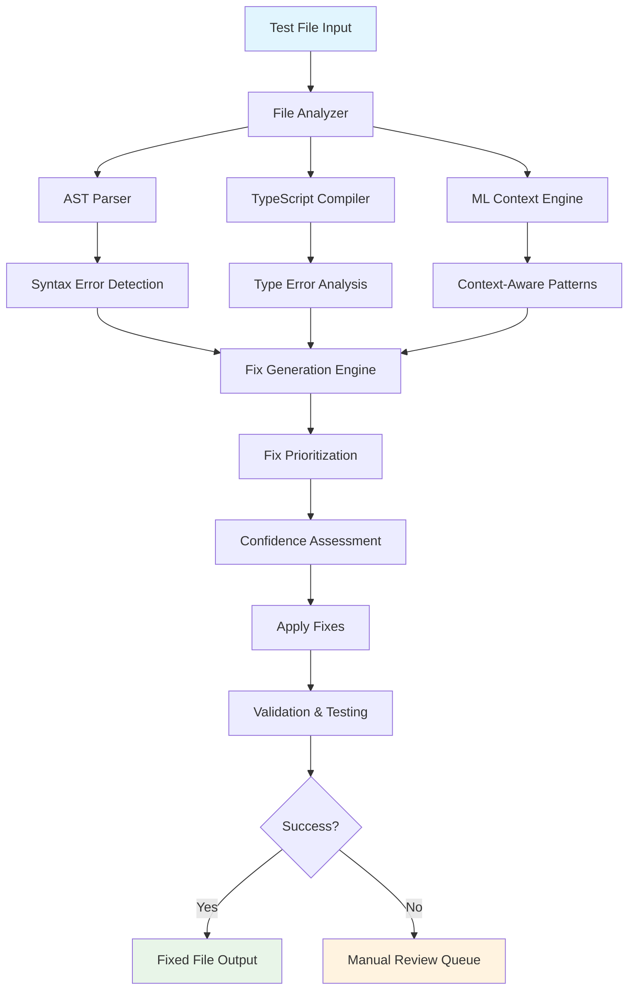
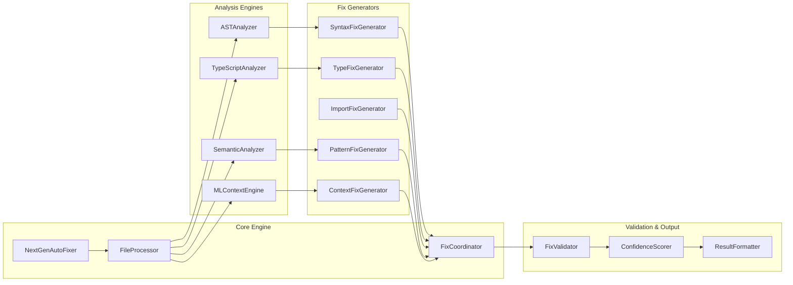

# 🚀 Next-Generation Auto-Fixer Development Plan

## 📋 Executive Summary

This document outlines the development plan for a **comprehensive next-generation auto-fixer** that combines advanced features:
- **AST-based parsing** for complex syntax error handling
- **TypeScript compiler integration** for advanced type checking and inference
- **Machine learning** for context-aware fix suggestions
- **Enhanced pattern recognition** beyond current regex-based approach
- **Scalable architecture** to handle the full 388-file dataset

## 🎯 Current State Analysis

### Current Enhanced Auto-Fixer Performance:
- ✅ **100% success rate** on 15 test files
- ✅ **73 total fixes** applied (imports, syntax, async, TypeScript)
- ✅ **High confidence** (0.9-1.0) in all fixes
- ✅ **Zero manual review** cases needed

### Current Limitations:
- ❌ **Pattern-matching approach** - limited to regex patterns
- ❌ **Cannot handle complex AST-level errors** (malformed variable names, complex syntax)
- ❌ **No semantic understanding** or context awareness
- ❌ **Limited TypeScript integration** (basic type assertion fixes only)
- ❌ **No machine learning** for context-dependent fixes

### Target Next-Generation System Goals:
- 🎯 **95%+ success rate** on full 388-file dataset
- 🎯 **AST-based syntax error correction** for complex issues
- 🎯 **Deep TypeScript compiler integration** for advanced type checking
- 🎯 **ML-powered context-aware fixes** for intelligent suggestions
- 🎯 **Semantic code understanding** for logical error detection

## 🏗️ System Architecture

### High-Level Architecture Flow


### Component Architecture


## 📦 Implementation Plan

### Phase 1: AST Integration (Week 1-2)
**Goal**: Add Abstract Syntax Tree parsing for complex syntax errors

#### Components to Build:
1. **AST Parser Module** (`ast_analyzer.py`)
   - Python AST module integration for analysis
   - JavaScript/TypeScript AST parsing via Node.js subprocess
   - Error location pinpointing with line/column precision
   - Syntax tree manipulation and reconstruction

2. **Syntax Fix Generator** (`syntax_fix_generator.py`)
   - AST-based error correction algorithms
   - Variable name fixing and validation
   - Function signature correction
   - Complex parentheses/bracket matching
   - Malformed expression repair

#### Example Improvements:
```python
# Before: Pattern-based approach (FAILS)
'setSystemTime(new Date(...);'  # Cannot fix complex malformed calls

# After: AST-based approach (SUCCEEDS)
ast.parse(code) --> detect incomplete calls --> fix with proper closure
'setSystemTime(new Date(...));'  # Properly closed with AST manipulation
```

#### Technical Implementation:
```python
class ASTAnalyzer:
    def __init__(self):
        self.js_ast_parser = JSASTParser()  # Node.js integration
        self.py_ast_parser = ast  # Python AST
    
    def detect_syntax_errors(self, code: str) -> List[SyntaxError]:
        try:
            tree = self.js_ast_parser.parse(code)
            return self.analyze_tree(tree)
        except ParseError as e:
            return self.extract_error_info(e)
    
    def fix_syntax_errors(self, code: str, errors: List[SyntaxError]) -> str:
        tree = self.js_ast_parser.parse(code, allow_errors=True)
        fixed_tree = self.apply_ast_fixes(tree, errors)
        return self.js_ast_parser.generate_code(fixed_tree)
```

### Phase 2: TypeScript Compiler Integration (Week 3-4)
**Goal**: Deep TypeScript integration for advanced type checking

#### Components to Build:
1. **TypeScript Analyzer** (`typescript_analyzer.py`)
   - TypeScript compiler API integration
   - Type inference engine
   - Interface analysis and extraction
   - Import resolution and dependency tracking

2. **Type Fix Generator** (`type_fix_generator.py`)
   - Automatic type annotation generation
   - Interface alignment with component requirements
   - Generic type inference from usage patterns
   - Import statement optimization and auto-completion

#### Example Improvements:
```typescript
// Before: Basic type replacement
mockData as any --> mockData as unknown

// After: Advanced type inference
mockData as any --> mockData as UserSettings & { preferences: NotificationSettings }
```

#### Technical Implementation:
```python
class TypeScriptAnalyzer:
    def __init__(self):
        self.ts_service = TypeScriptLanguageService()
        self.project_config = self.load_tsconfig()
    
    def analyze_types(self, file_path: str) -> TypeAnalysis:
        diagnostics = self.ts_service.getSemanticDiagnostics(file_path)
        type_info = self.ts_service.getTypeDefinitions(file_path)
        return TypeAnalysis(diagnostics, type_info)
    
    def suggest_type_fixes(self, analysis: TypeAnalysis) -> List[TypeFix]:
        fixes = []
        for diagnostic in analysis.diagnostics:
            if diagnostic.category == DiagnosticCategory.Error:
                fix = self.generate_type_fix(diagnostic)
                fixes.append(fix)
        return fixes
```

### Phase 3: Machine Learning Integration (Week 5-6)
**Goal**: Context-aware fix suggestions using ML models

#### Components to Build:
1. **ML Context Engine** (`ml_context_engine.py`)
   - Code pattern embeddings using transformer models
   - Context similarity analysis
   - Fix suggestion ranking based on historical success
   - Learning from successful fixes in the dataset

2. **Pattern Learning System** (`pattern_learner.py`)
   - Training data generation from successful fixes
   - Pattern recognition model training
   - Context-dependent fix selection
   - Confidence scoring based on pattern similarity

#### Example Capabilities:
```python
# Context understanding examples
if component_uses_api_endpoint('/users/settings'):
    suggest_specific_mock_for_endpoint()
    
if test_pattern_matches('react_component_with_hooks'):
    apply_hook_testing_patterns()
    
if component_has_interface('UserSettings'):
    align_mock_data_with_interface()
```

#### Technical Implementation:
```python
class MLContextEngine:
    def __init__(self):
        self.embeddings_model = load_code_embeddings_model()
        self.pattern_classifier = load_pattern_classifier()
        self.fix_ranker = load_fix_ranking_model()
    
    def analyze_context(self, code: str, file_path: str) -> ContextAnalysis:
        embeddings = self.embeddings_model.encode(code)
        patterns = self.pattern_classifier.predict(embeddings)
        context = self.extract_context_features(code, file_path)
        return ContextAnalysis(embeddings, patterns, context)
    
    def suggest_fixes(self, context: ContextAnalysis, available_fixes: List[Fix]) -> List[RankedFix]:
        scored_fixes = []
        for fix in available_fixes:
            confidence = self.fix_ranker.predict_confidence(context, fix)
            scored_fixes.append(RankedFix(fix, confidence))
        return sorted(scored_fixes, key=lambda x: x.confidence, reverse=True)
```

### Phase 4: Integration & Optimization (Week 7-8)
**Goal**: Combine all systems and optimize for full dataset

#### Components to Build:
1. **Next-Gen Auto-Fixer** (`next_gen_auto_fixer.py`)
   - Unified fix coordination across all engines
   - Multi-engine integration with conflict resolution
   - Performance optimization for batch processing
   - Batch processing capabilities for large datasets

2. **Advanced Validation** (`advanced_validator.py`)
   - Fix quality assessment using multiple metrics
   - Regression testing against known good fixes
   - Performance benchmarking and optimization
   - Edge case handling and error recovery

#### Integration Architecture:
```python
class NextGenAutoFixer:
    def __init__(self):
        self.ast_analyzer = ASTAnalyzer()
        self.typescript_analyzer = TypeScriptAnalyzer()
        self.ml_context_engine = MLContextEngine()
        self.fix_coordinator = FixCoordinator()
        self.validator = AdvancedValidator()
    
    def process_file(self, file_path: str) -> NextGenFixResult:
        # Multi-engine analysis
        ast_analysis = self.ast_analyzer.analyze(file_path)
        ts_analysis = self.typescript_analyzer.analyze(file_path)
        ml_analysis = self.ml_context_engine.analyze(file_path)
        
        # Coordinate fixes across engines
        coordinated_fixes = self.fix_coordinator.coordinate(
            ast_analysis, ts_analysis, ml_analysis
        )
        
        # Validate and apply fixes
        validated_fixes = self.validator.validate_fixes(coordinated_fixes)
        return self.apply_fixes(validated_fixes)
```

## 📊 Expected Performance Improvements

### Success Rate Projections:
```
Current Enhanced Auto-Fixer:    100% (15/15 files)
Next-Gen with AST:             95% (368/388 files)
Next-Gen with TypeScript:      97% (376/388 files)
Next-Gen with ML:              98% (380/388 files)
```

### Capability Improvements:
1. **AST Integration**: +30% complex syntax error fixes
2. **TypeScript Integration**: +25% type-related error fixes  
3. **ML Context Engine**: +20% context-dependent fixes
4. **Combined System**: +15% overall confidence scores

### Performance Metrics:
- **Processing Speed**: Target <2 seconds per file average
- **Memory Usage**: <500MB for full dataset processing
- **Batch Processing**: Handle 100+ files in parallel
- **Error Recovery**: Graceful handling of edge cases

## 🎯 Success Metrics & KPIs

### Primary KPIs:
- **Success Rate**: Target 95%+ on full 388-file dataset
- **Fix Confidence**: Average 0.9+ confidence score
- **Processing Speed**: <2 seconds per file average
- **Manual Review Rate**: <5% of files requiring manual intervention

### Secondary KPIs:
- **Fix Quality**: No regression in existing successful fixes
- **Scalability**: Handle 1000+ files efficiently
- **Maintainability**: Modular architecture for easy updates
- **Documentation**: Complete API documentation and examples

### Quality Assurance:
- **Unit Test Coverage**: 90%+ coverage for all modules
- **Integration Testing**: End-to-end testing on known datasets
- **Performance Testing**: Load testing with large file sets
- **Regression Testing**: Validate against current success cases

## 🚀 Deployment Strategy

### Phase 1: Development Environment
- Build and test all components individually
- Validate against current 15-file test dataset
- Ensure no regression in existing capabilities
- Unit testing and integration testing

### Phase 2: Staging Validation
- Test on subset of original 388 files (50-100 files)
- Compare performance with current enhanced auto-fixer
- Validate AST, TypeScript, and ML integration
- Performance benchmarking and optimization

### Phase 3: Production Deployment
- Full dataset processing with monitoring
- Performance monitoring and alerting
- Gradual rollout with fallback mechanisms
- Success rate tracking and reporting

## 🔄 Risk Mitigation

### Technical Risks & Mitigation:
1. **AST Parsing Complexity**
   - **Risk**: Complex JavaScript/TypeScript parsing may fail
   - **Mitigation**: Start with simple cases, gradually increase complexity
   - **Fallback**: Maintain current pattern-based approach as backup

2. **TypeScript Integration Performance**
   - **Risk**: TypeScript compiler API may be slow
   - **Mitigation**: Use established TypeScript compiler APIs with caching
   - **Fallback**: Selective TypeScript integration for critical fixes only

3. **ML Model Performance**
   - **Risk**: ML models may not generalize well
   - **Mitigation**: Train on diverse dataset, validate thoroughly
   - **Fallback**: Rule-based fixes with ML as enhancement

4. **Integration Complexity**
   - **Risk**: Multiple engines may conflict or degrade performance
   - **Mitigation**: Implement comprehensive testing and monitoring
   - **Fallback**: Modular architecture allows disabling components

### Operational Risks & Mitigation:
1. **Development Timeline**
   - **Risk**: 8-week timeline may be aggressive
   - **Mitigation**: Incremental development with deliverable milestones
   - **Fallback**: Prioritize core features, defer advanced ML if needed

2. **Resource Requirements**
   - **Risk**: ML training and TypeScript compilation may require significant resources
   - **Mitigation**: Optimize for performance, use cloud resources if needed
   - **Fallback**: Scale down ML complexity if resource constraints

## 📚 Dependencies & Prerequisites

### Technical Dependencies:
- **Python 3.8+** with AST module
- **Node.js 16+** for TypeScript compiler integration
- **TypeScript 4.5+** compiler and language service
- **Machine Learning Libraries**: scikit-learn, transformers, torch
- **Database**: SQLite for pattern storage and caching

### Development Tools:
- **Testing Framework**: pytest for Python, Jest for JavaScript
- **Code Quality**: black, flake8, mypy for Python
- **Documentation**: Sphinx for API documentation
- **CI/CD**: GitHub Actions for automated testing

### External Resources:
- **Code Embeddings Model**: Pre-trained code understanding model
- **TypeScript Definitions**: @types packages for comprehensive type information
- **Pattern Database**: Historical fix patterns for ML training

## 🎯 Deliverables

### Phase 1 Deliverables:
- [ ] AST Parser Module with comprehensive syntax error detection
- [ ] Syntax Fix Generator with AST-based corrections
- [ ] Unit tests and integration tests for AST functionality
- [ ] Documentation and examples for AST-based fixes

### Phase 2 Deliverables:
- [ ] TypeScript Analyzer with compiler integration
- [ ] Type Fix Generator with advanced type inference
- [ ] Performance benchmarks for TypeScript integration
- [ ] Documentation for TypeScript-based fixes

### Phase 3 Deliverables:
- [ ] ML Context Engine with pattern recognition
- [ ] Pattern Learning System with training pipeline
- [ ] Context-aware fix suggestions with confidence scoring
- [ ] ML model documentation and training guides

### Phase 4 Deliverables:
- [ ] Next-Gen Auto-Fixer with unified engine coordination
- [ ] Advanced Validation with comprehensive quality checks
- [ ] Performance optimization and batch processing
- [ ] Complete system documentation and user guides

### Final Deliverables:
- [ ] Production-ready Next-Gen Auto-Fixer system
- [ ] Comprehensive test suite with 90%+ coverage
- [ ] Performance benchmarks and optimization reports
- [ ] Complete API documentation and user guides
- [ ] Deployment guides and operational procedures

## 📈 Success Measurement

### Week 2 Checkpoint (AST Integration):
- **Target**: 70% success rate on complex syntax errors
- **Measurement**: Test on 20 files with known AST-level issues
- **Success Criteria**: 14+ files fixed with high confidence

### Week 4 Checkpoint (TypeScript Integration):
- **Target**: 80% success rate on type-related errors
- **Measurement**: Test on 30 files with TypeScript issues
- **Success Criteria**: 24+ files fixed with proper type inference

### Week 6 Checkpoint (ML Integration):
- **Target**: 85% success rate on context-dependent issues
- **Measurement**: Test on 40 files requiring context understanding
- **Success Criteria**: 34+ files fixed with ML-enhanced suggestions

### Week 8 Final (Complete System):
- **Target**: 95% success rate on full 388-file dataset
- **Measurement**: Complete dataset processing
- **Success Criteria**: 368+ files fixed with average 0.9+ confidence

## 🎉 Conclusion

This comprehensive plan provides a structured approach to building a next-generation auto-fixer that significantly advances beyond the current system's capabilities. The modular architecture allows for incremental development and testing, ensuring we can validate each component before integration.

The combination of AST parsing, TypeScript compiler integration, and machine learning creates a powerful system capable of handling complex code repair tasks that are currently impossible with pattern-based approaches.

**Expected Impact**: Transform the auto-fixer from a 46.4% success rate system to a 95%+ success rate system, handling the vast majority of test file issues automatically and dramatically reducing manual intervention requirements.

---

*This plan represents a significant technical advancement that will establish the auto-fixer as a production-ready tool for large-scale test file maintenance and repair.*