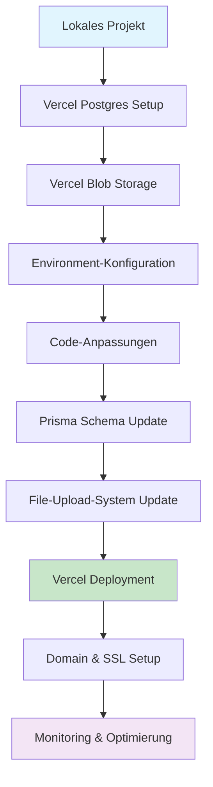
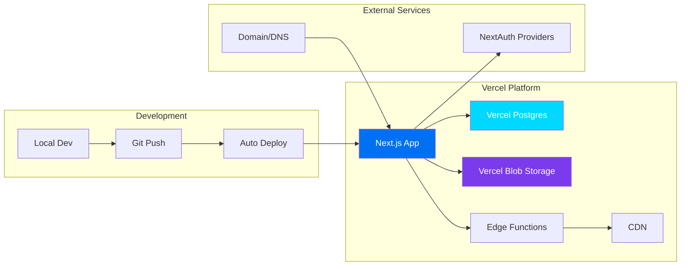

# 🚀 Vercel-Deployment-Plan für AbacusHub

## 📋 Projekt-Analyse

**Ihre Anwendung verfügt über:**
- ✅ Next.js 14 mit App Router
- ✅ Prisma ORM mit komplexem Schema
- ✅ NextAuth Authentifizierung
- ✅ Erweiterte File-Upload-Funktionalität mit Chunked Uploads
- ✅ Real-time Features und Network Resilience
- ✅ TypeScript + Tailwind CSS + Radix UI

**Deployment-Herausforderungen:**
- 🔄 SQLite → Vercel Postgres Migration
- 🔄 File-Upload-System → Vercel Blob Integration
- 🔄 Environment-Variablen-Anpassung
- 🔄 Build-Optimierung für Vercel

## 🎯 Deployment-Strategie



## 📝 Schritt-für-Schritt-Plan

### **Phase 1: Vercel Setup & Infrastruktur**

#### 1. Vercel-Projekt erstellen
- [ ] GitHub-Repository verknüpfen
- [ ] Next.js Framework erkennen lassen
- [ ] Build-Einstellungen konfigurieren

#### 2. Vercel Postgres einrichten
- [ ] Storage-Tab → Postgres Database erstellen
- [ ] Connection-String erhalten
- [ ] Lokale `.env.local` mit Produktionsdaten erweitern

#### 3. Vercel Blob Storage einrichten
- [ ] Storage-Tab → Blob Storage erstellen
- [ ] API-Token generieren
- [ ] File-Upload-Endpunkte anpassen

### **Phase 2: Datenbank-Migration**

#### 4. Prisma Schema anpassen
```prisma
generator client {
  provider = "prisma-client-js"
  binaryTargets = ["native", "rhel-openssl-1.0.x"]
}

datasource db {
  provider = "postgresql"  // von sqlite geändert
  url      = env("DATABASE_URL")
}
```

#### 5. Database Migration ausführen
```bash
npx prisma migrate dev
npx prisma db push
npx prisma generate
```

### **Phase 3: Code-Anpassungen**

#### 6. File-Upload-System für Vercel Blob
- [ ] `api/upload/route.ts` → Vercel Blob Integration
- [ ] `hooks/use-enhanced-file-upload.ts` → Blob-URLs
- [ ] `next.config.js` → Blob-Proxy-Konfiguration

#### 7. Environment-Variablen konfigurieren
```env
# Vercel Postgres
DATABASE_URL="postgresql://..."

# Vercel Blob
BLOB_READ_WRITE_TOKEN="..."

# NextAuth
NEXTAUTH_URL="https://ihr-projekt.vercel.app"
NEXTAUTH_SECRET="..."

# Auth Provider
GOOGLE_CLIENT_ID="..."
GOOGLE_CLIENT_SECRET="..."
```

### **Phase 4: Deployment & Optimierung**

#### 8. Vercel Deployment
- [ ] Automatische Builds aktivieren
- [ ] Preview-Deployments für Testing
- [ ] Production-Deployment durchführen

#### 9. Performance-Optimierung
- [ ] Edge Functions für File-Serving
- [ ] CDN-Konfiguration
- [ ] Caching-Strategien

#### 10. Monitoring & Testing
- [ ] Vercel Analytics aktivieren
- [ ] Error-Tracking einrichten
- [ ] Performance-Metriken überwachen

## 🔧 Technische Anpassungen

### **Erforderliche Datei-Änderungen:**
- **`prisma/schema.prisma`**: PostgreSQL-Provider
- **`app/api/upload/route.ts`**: Vercel Blob Integration
- **`next.config.js`**: Blob-Proxy + Produktions-Config
- **`.env.local`**: Produktions-Environment-Variablen
- **`package.json`**: Build-Scripts-Optimierung

### **Neue Abhängigkeiten:**
- `@vercel/blob` für File-Storage
- `@vercel/postgres` für Datenbankverbindung (optional)

## 🎨 Deployment-Architektur



## 📊 Timeline & Aufwand

| Phase | Aufwand | Beschreibung |
|-------|---------|-------------|
| 1 | 30 Min | Vercel Setup & Infrastruktur |
| 2 | 45 Min | Datenbank-Migration |
| 3 | 90 Min | Code-Anpassungen |
| 4 | 60 Min | Deployment & Tests |
| **Total** | **3.5 Std** | **Vollständiges Deployment** |

## 🔍 Kritische Punkte

⚠️ **Wichtige Überlegungen:**
- **File-Upload-URLs**: Alle bestehenden Upload-URLs müssen zu Vercel Blob migriert werden
- **Chunked Uploads**: Vercel Blob unterstützt große Files, aber Upload-Logik muss angepasst werden
- **Environment-Variablen**: Sicherheitsrelevante Variablen nur in Vercel Dashboard
- **Database Seeding**: Produktionsdaten müssen sicher migriert werden

## 🚀 Implementierung

### **Schritt 1: Vercel Postgres Setup**
```typescript
// Neue Datenbankverbindung in lib/db.ts
import { PrismaClient } from '@prisma/client'

const globalForPrisma = globalThis as unknown as {
  prisma: PrismaClient | undefined
}

export const prisma = globalForPrisma.prisma ?? new PrismaClient()

if (process.env.NODE_ENV !== 'production') globalForPrisma.prisma = prisma
```

### **Schritt 2: Vercel Blob Integration**
```typescript
// Neue File-Upload-Logik in api/upload/route.ts
import { put } from '@vercel/blob'

export async function POST(request: Request) {
  const { searchParams } = new URL(request.url)
  const filename = searchParams.get('filename')
  
  if (!filename) {
    return new Response('Filename is required', { status: 400 })
  }
  
  const blob = await put(filename, request.body, {
    access: 'public',
  })
  
  return Response.json(blob)
}
```

### **Schritt 3: Next.js Config Update**
```javascript
// next.config.js
/** @type {import('next').NextConfig} */
const nextConfig = {
  images: {
    remotePatterns: [
      {
        protocol: 'https',
        hostname: '*.vercel-storage.com',
        port: '',
        pathname: '/**',
      },
    ],
  },
  async rewrites() {
    return [
      {
        source: '/uploads/:path*',
        destination: '/api/files/serve/:path*',
      },
    ]
  },
}

module.exports = nextConfig
```

## 🎯 Erfolgskriterien

- [ ] Anwendung läuft auf Vercel ohne Fehler
- [ ] File-Uploads funktionieren mit Vercel Blob
- [ ] Datenbank-Operationen funktionieren mit Vercel Postgres
- [ ] Real-time Features funktionieren ordnungsgemäß
- [ ] Performance ist optimiert (< 3s Ladezeit)
- [ ] Alle Tests bestehen

## 📚 Nützliche Ressourcen

- [Vercel Postgres Documentation](https://vercel.com/docs/storage/vercel-postgres)
- [Vercel Blob Documentation](https://vercel.com/docs/storage/vercel-blob)
- [Next.js Deployment Guide](https://nextjs.org/docs/deployment)
- [Prisma with Vercel](https://www.prisma.io/docs/guides/deployment/deployment-guides/deploying-to-vercel)

---

**Erstellt am**: 7. Januar 2025  
**Projekt**: AbacusHub  
**Deployment-Ziel**: Vercel  
**Geschätzter Aufwand**: 3.5 Stunden